# 👟 CoolKicks

Platform e-commerce sneakers berbasis microservice yang mencakup manajemen produk, sistem pemesanan, autentikasi pengguna, dan komunikasi asinkron antar service.

---

## Tentang Project

CoolKicks adalah backend service untuk toko sneakers online yang dibangun menggunakan arsitektur microservice. Setiap komponen berjalan sebagai service mandiri dan berkomunikasi melalui satu titik akses terpusat. Project ini mencakup empat komponen utama yaitu database dengan relasi antar entitas, autentikasi berbasis JWT, komunikasi asinkron menggunakan message broker, dan API Gateway sebagai entry point tunggal.

---

## Arsitektur Sistem

Seluruh request dari client masuk melalui **API Gateway** yang berjalan di port `3000`. Gateway kemudian meneruskan request ke service yang sesuai berdasarkan path prefix. Terdapat dua service utama yaitu **Auth Service** dan **Product Service**, keduanya terhubung ke database MySQL yang sama. Ketika sebuah order berhasil dibuat, Product Service mempublikasikan event ke **RabbitMQ** dan **Order Consumer** memproses event tersebut secara asinkron di latar belakang.

```
Client → API Gateway :3000
              ├── /auth      → Auth Service :3001
              └── /products
                  /orders   → Product Service :3002
                                    │
                                    ▼
                              RabbitMQ :5672
                                    │
                                    ▼
                             Order Consumer
                                    │
                                    ▼
                            MySQL Database :3306
```

---

## Fitur

- Registrasi dan login pengguna dengan JWT
- Otorisasi berbasis role (admin dan customer)
- Manajemen produk sneakers (CRUD) khusus admin
- Pembuatan dan pembatalan order oleh customer
- Pemrosesan order secara asinkron via RabbitMQ
- Pengurangan stok otomatis setelah order diproses
- Dead Letter Queue untuk penanganan pesan gagal
- Rate limiting 100 request per 15 menit di Gateway
- Request logging di setiap akses masuk

---

## Teknologi

| Komponen | Teknologi |
|---|---|
| Runtime | Node.js v18+ |
| Framework | Express.js |
| Database | MySQL 8 |
| ORM | Sequelize |
| Autentikasi | JSON Web Token |
| Message Broker | RabbitMQ |
| API Gateway | http-proxy-middleware |
| Password Hashing | bcryptjs |
| Validasi Input | express-validator |

---

## Struktur Service

### API Gateway
Satu-satunya titik masuk dari luar. Menangani routing, rate limiting, dan logging sebelum request diteruskan ke service yang sesuai.

### Auth Service
Mengelola data pengguna, proses registrasi, login, dan penerbitan JWT. Menyediakan endpoint untuk manajemen user khusus admin.

### Product Service
Mengelola data produk dan order. Setelah order berhasil dibuat dan disimpan ke database, service ini mempublikasikan event ke RabbitMQ tanpa menghambat response ke client.

### Order Consumer
Proses background yang berjalan terpisah. Bertugas menerima event order dari RabbitMQ, mengurangi stok produk, memperbarui status order, dan mencatat notifikasi.

---

## Persyaratan Sistem

Pastikan seluruh dependensi berikut sudah terinstal di server sebelum menjalankan project:

- Node.js versi 18 atau lebih baru
- NPM
- MySQL 8
- RabbitMQ

---

## Instalasi & Menjalankan Service

**1. Clone repository**

```bash
git clone <url-repository>
cd coolkicks
```

**2. Buat database MySQL**

```bash
mysql -u mahasiswa -p
```

```sql
CREATE DATABASE 2410511081_db_coolkicks
```

**3. Pastikan RabbitMQ aktif**

```bash
sudo systemctl start rabbitmq-server
```

**4. Install dependencies semua service**

```bash
cd gateway          && npm install && cd ..
cd auth-service     && npm install && cd ..
cd product-service  && npm install && cd ..
cd order-consumer   && npm install && cd ..
```

**5. Sesuaikan file `.env` di masing-masing service** dengan konfigurasi database dan RabbitMQ yang digunakan.

---

## Endpoint

Base URL: `http://103.147.92.134:4081`

### Auth

| Method | Endpoint | Akses | Deskripsi |
|---|---|---|---|
| POST | `/auth/register` | Public | Registrasi user baru |
| POST | `/auth/login` | Public | Login dan mendapatkan token |
| GET | `/auth/profile` | User | Melihat profil sendiri |
| GET | `/auth/users` | Admin | Melihat semua user |
| DELETE | `/auth/users/:id` | Admin | Menghapus user |

### Produk

| Method | Endpoint | Akses | Deskripsi |
|---|---|---|---|
| GET | `/products` | Public | Melihat semua produk |
| GET | `/products/:id` | Public | Melihat detail produk |
| POST | `/products` | Admin | Menambah produk baru |
| PUT | `/products/:id` | Admin | Mengubah data produk |
| DELETE | `/products/:id` | Admin | Menghapus produk |

### Order

| Method | Endpoint | Akses | Deskripsi |
|---|---|---|---|
| POST | `/orders` | Customer | Membuat order baru |
| GET | `/orders/my` | User | Melihat order sendiri |
| PUT | `/orders/:id/cancel` | Customer | Membatalkan order |
| GET | `/orders` | Admin | Melihat semua order |
| PUT | `/orders/:id/status` | Admin | Mengubah status order |

---

## Role & Hak Akses

| Fitur | Customer | Admin |
|---|:---:|:---:|
| Register & Login | ✓ | ✓ |
| Lihat profil sendiri | ✓ | ✓ |
| Lihat & hapus semua user | ✗ | ✓ |
| Lihat daftar produk | ✓ | ✓ |
| Tambah / ubah / hapus produk | ✗ | ✓ |
| Buat order | ✓ | ✗ |
| Lihat order sendiri | ✓ | ✓ |
| Batalkan order sendiri | ✓ | ✗ |
| Lihat semua order | ✗ | ✓ |
| Ubah status order | ✗ | ✓ |

---

## Alur Order & Message Broker

1. Customer mengirim request `POST /orders` ke Gateway
2. Product Service memvalidasi stok dan menyimpan order ke database dengan status `pending`
3. Response `201` langsung dikembalikan ke client
4. Secara asinkron, event dikirim ke queue `order_queue` di RabbitMQ
5. Order Consumer menerima event, mengurangi stok produk, dan memperbarui status order menjadi `processed`
6. Jika consumer gagal memproses, pesan dipindahkan ke Dead Letter Queue `order_queue_dlq` untuk investigasi

---

## Variabel Environment

Setiap service memiliki file `.env` masing-masing. Berikut variabel yang perlu dikonfigurasi:

| Variabel | Keterangan |
|---|---|
| `PORT` | Port service berjalan |
| `DB_HOST` | Host database MySQL |
| `DB_NAME` | Nama database |
| `DB_USER` | Username database |
| `DB_PASS` | Password database |
| `JWT_SECRET` | Secret key untuk signing token |
| `JWT_EXPIRES_IN` | Durasi token berlaku, contoh `1d` |
| `RABBITMQ_URL` | URL koneksi RabbitMQ, contoh `amqp://localhost` |
| `ORDER_QUEUE` | Nama queue utama |
| `ORDER_DLQ` | Nama dead letter queue |

---

## Struktur Direktori

```
coolkicks/
├── gateway/
├── auth-service/
├── product-service/
├── order-consumer/
├── screenshots/
├── .gitignore
├── collection.json
└── README.md
```

---

## Screenshots

### Auth Service

| No | Endpoint | Screenshot |
|---|---|---|
| 1 | POST `/auth/register` — customer | 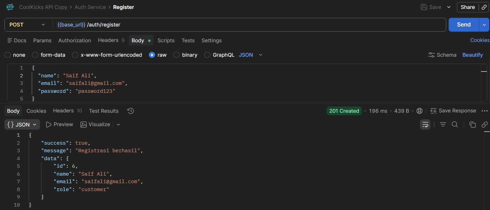 |
| 2 | POST `/auth/register` — admin | 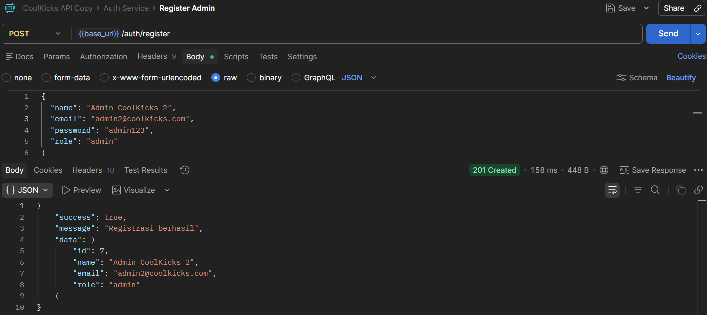 |
| 3 | POST `/auth/login` — customer | 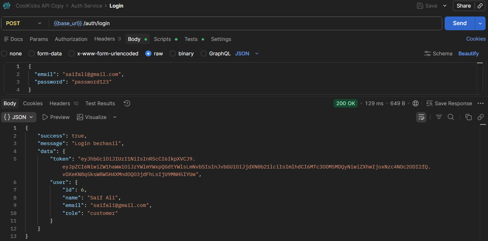 |
| 4 | POST `/auth/login` — admin | 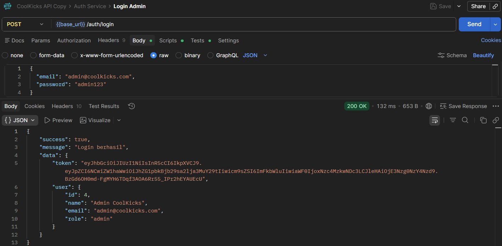 |
| 5 | GET `/auth/profile` | 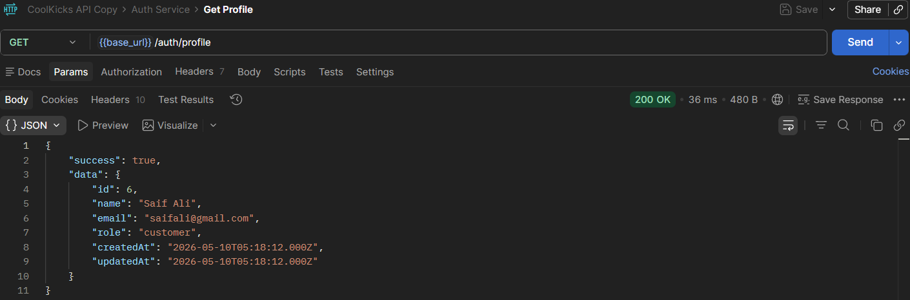 |
| 6 | GET `/auth/users` — admin | 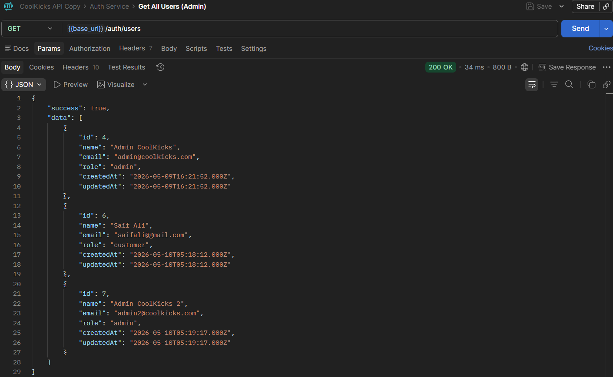 |
| 7 | DELETE `/auth/users/:id` — admin | 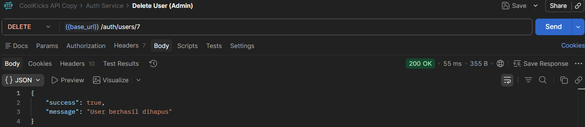 |

### Product Service

| No | Endpoint | Screenshot |
|---|---|---|
| 8 | GET `/products` | 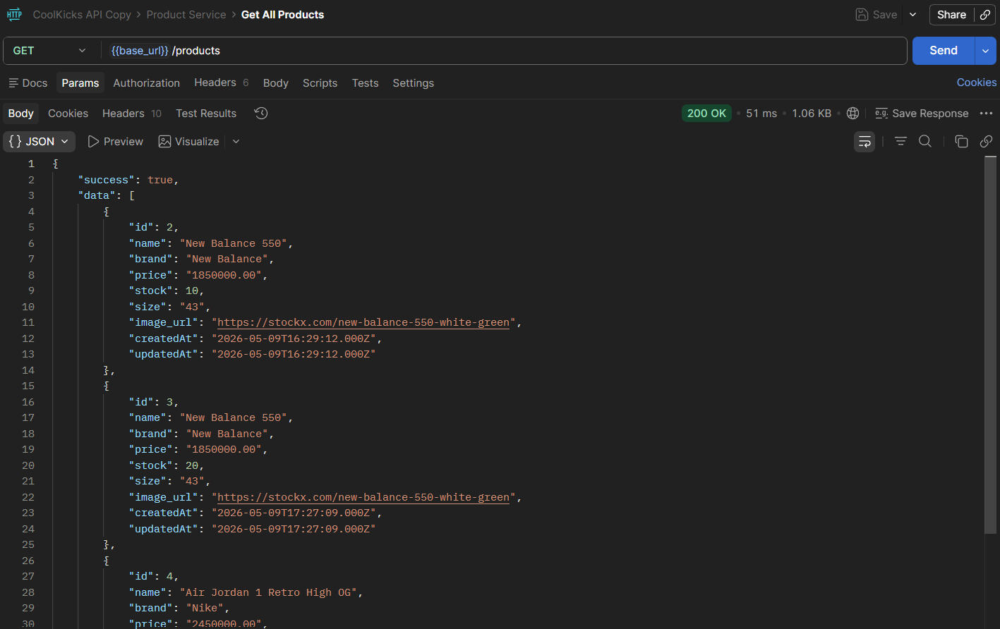 |
| 9 | GET `/products/:id` | 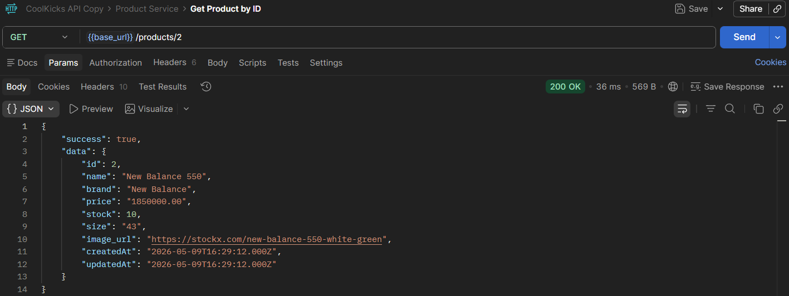 |
| 10 | POST `/products` — admin | 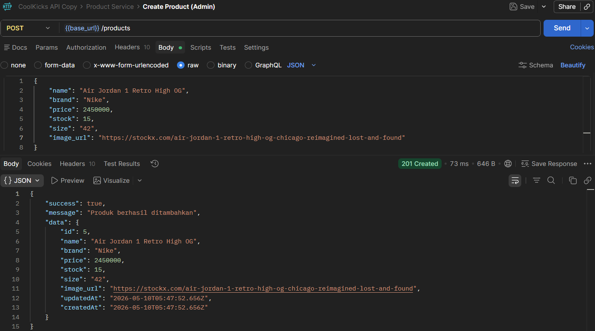 |
| 11 | PUT `/products/:id` — admin | 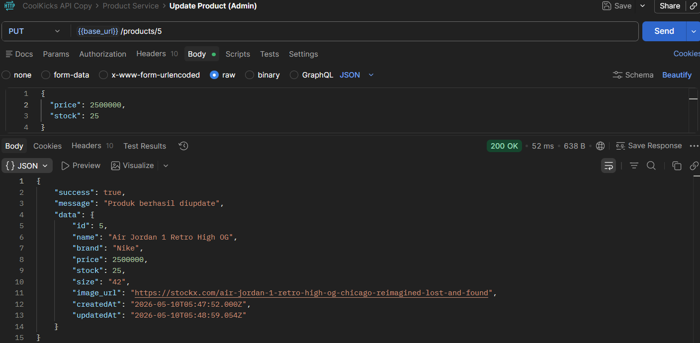 |
| 12 | DELETE `/products/:id` — admin | 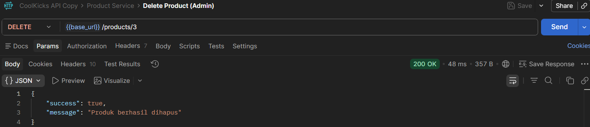 |

### Order Service

| No | Endpoint | Screenshot |
|---|---|---|
| 13 | POST `/orders` — customer | 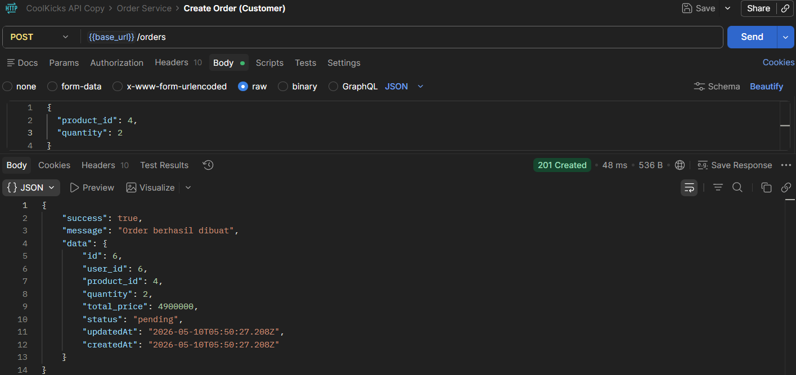 |
| 14 | GET `/orders/my` — customer | 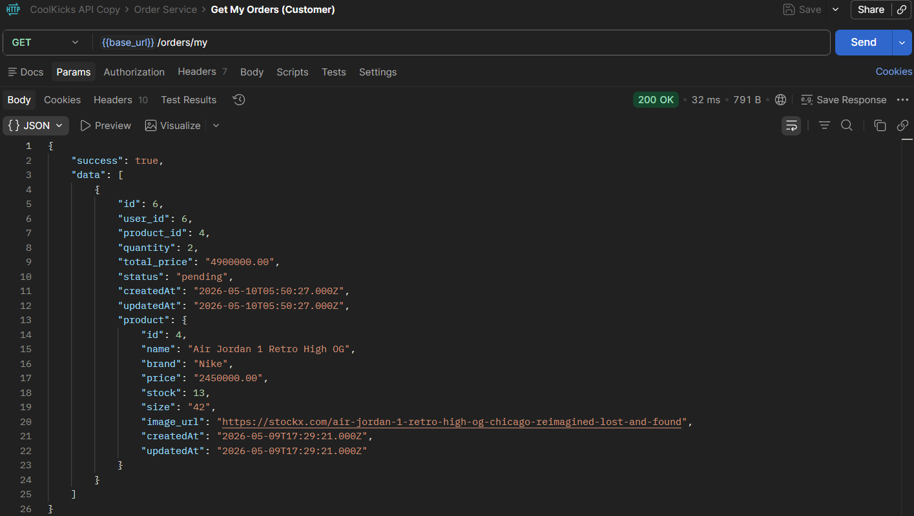 |
| 15 | PUT `/orders/:id/cancel` — customer | 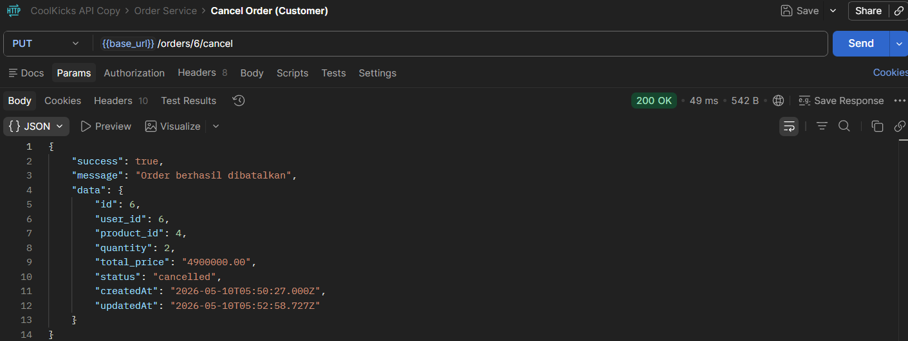 |
| 16 | GET `/orders` — admin | 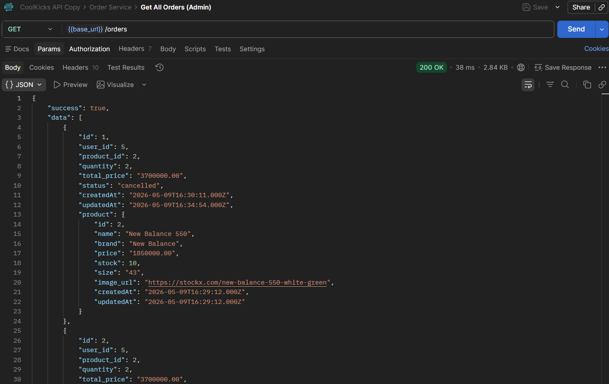 |
| 17 | PUT `/orders/:id/status` — admin | 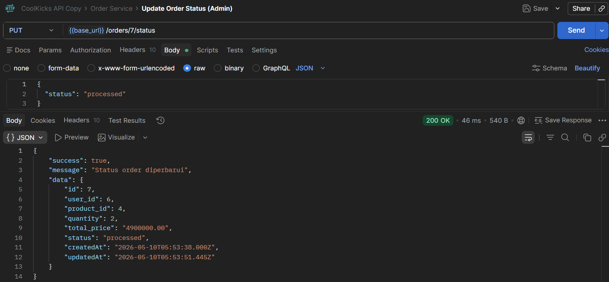 |

### Gateway

| No | Endpoint | Screenshot |
|---|---|---|
| 18 | GET `/health` | 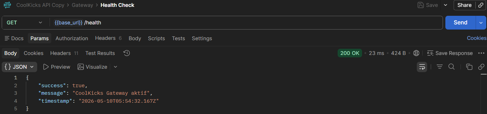 |

---

## Catatan

- File `.env` tidak ikut ter-commit ke repository karena masuk daftar `.gitignore`
- Tabel database dibuat otomatis oleh Sequelize saat service pertama kali dijalankan
- Untuk import collection ke Postman, gunakan file `CoolKicks.postman_collection.json` yang tersedia di repository